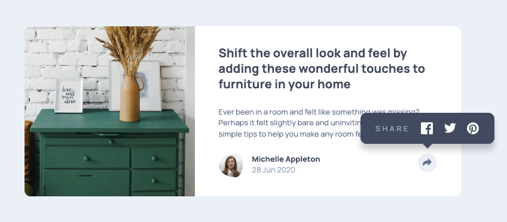
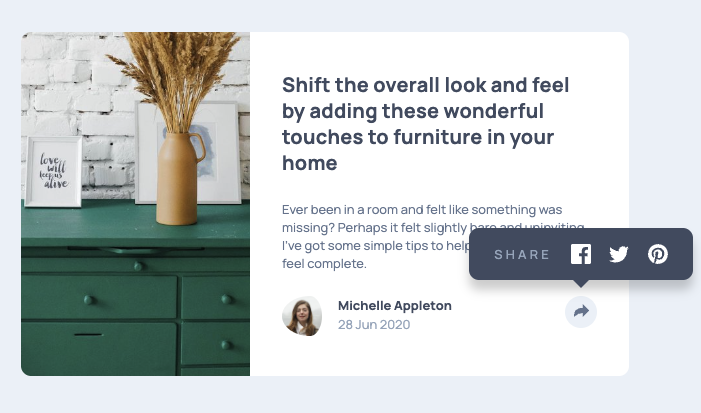
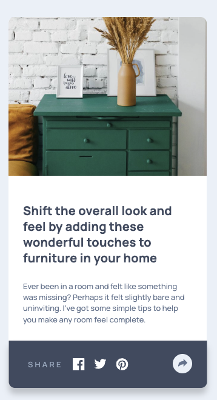

# Frontend Mentor - Article preview component solution

This is a solution to the [Article preview component challenge on Frontend Mentor](https://www.frontendmentor.io/challenges/article-preview-component-dYBN_pYFT). Frontend Mentor challenges help you improve your coding skills by building realistic projects. 

## Table of contents

- [Overview](#overview)
  - [The challenge](#the-challenge)
  - [Screenshot](#screenshot)
  - [Links](#links)
- [My process](#my-process)
  - [Built with](#built-with)
  - [What I learned](#what-i-learned)
- [Author](#author)

## Overview

### The challenge

Users should be able to:

- View the optimal layout for the component depending on their device's screen size
- See the social media share links when they click the share icon

### Screenshot

;

### Links

- Solution URL: [https://github.com/majdal01/article-preview-component.git]
- Live Site URL: [https://majdal01.github.io/article-preview-component/]

## My process

### Built with

- Semantic HTML5 markup
- SCSS
- JavaScript

### What I learned

That I tend to make things complicated. This only need a small JavaScript code, but I started out with a much longer version taking a lot of things into account. 

## Author

- Frontend Mentor - [@majdal01](https://www.frontendmentor.io/profile/majdal01)

